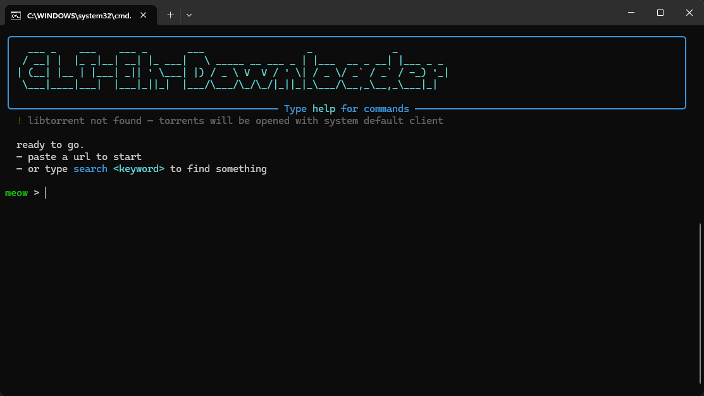
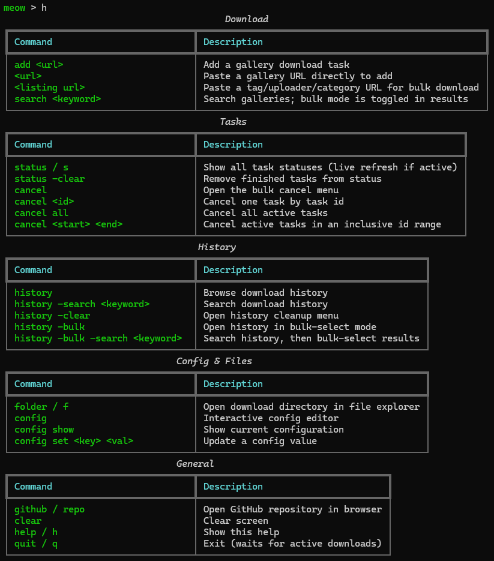

[English](README.md) | [繁體中文](README_zh.md) | [简体中文](README_zh_cn.md)

# CLI-Eh-Downloader

為 E-Hentai 與 ExHentai 設計的命令列畫廊下載工具，內建互動式 Shell 介面。


*互動式 Shell 介面*


*指令列表與執行畫面*

## 功能特色

- **互動式 Shell：** 直觀、支援豐富文字色彩的命令列介面。
- **智慧下載：** 支援標準畫廊下載與自動 Torrent 種子下載（支援內建下載，或自動呼叫系統上的外部客戶端如 qBittorrent 等）。
- **高度可設定：** 支援自訂下載目錄、平行任務數量及 Cookies 登入憑證。
- **自動環境部署：** Windows 使用者可透過內建的 `.bat` 腳本實現一鍵安裝與啟動。

## 安裝與設定

### 系統要求

- **Python 3.11** 或更新版本。
- （選用）`libtorrent` 以支援內建的種子下載功能。若未安裝，程式會將 `.torrent` 檔下載下來，並嘗試使用系統預設的種子客戶端（例如 qBittorrent 等）來進行下載。

### 下載專案 (Clone Repository)

首先，將專案 clone 到你的電腦上：
```bash
git clone https://github.com/RyuuMeow/CLI-Eh-Downloader.git
cd CLI-Eh-Downloader
```

### 快速開始 (Windows)

1. 點擊執行 **`CLI-Eh-Downloader.bat`**。
2. 如果是首次執行，腳本會主動詢問是否要自動建立虛擬環境 (`venv`) 並安裝所有必要的依賴套件。輸入 `Y` 確認。
3. 安裝完成後，將會自動進入互動式 Shell 介面。

### 手動安裝 (所有平台)

1. 建立虛擬環境並啟動它：
   ```bash
   python -m venv venv
   source venv/bin/activate  # Windows 環境請輸入: venv\Scripts\activate
   ```
2. 安裝套件及依賴：
   ```bash
   pip install -e .
   ```
3. 啟動應用程式：
   ```bash
   ehdl
   # 或是直接透過 Python 模組啟動: python -m cli_eh_downloader
   ```

## 使用方法

你可以進入互動式 Shell 介面，也可以在終端機直接帶參數執行：

```bash
# 啟動互動式 Shell
ehdl

# 直接下載指定的畫廊
ehdl <gallery_url>

# 強制透過 Torrent 下載
ehdl <gallery_url> --torrent
```

在互動式 Shell 中，可以輸入 `help` 來查看所有支援的指令。

## 設定檔

程式會自動在 `~/.config/cli-eh-downloader/config.toml` （如果當前目錄有 `config.toml` 則優先讀取）建立設定檔。你可以在裡面設定下載資料夾、下載限制以及用於身分驗證的 Cookies。

## 免責聲明

**僅供學術與教育研究用途。** 
本工具的開發目的僅為學習 Python 程式設計、API 互動及命令列介面設計。作者不認可亦不鼓勵任何未經授權的版權內容下載與散佈行為。使用本軟體時，您必須對自己的行為負完全責任，並確保您的使用方式符合當地法律及相關網站的服務條款 (Terms of Service)。
