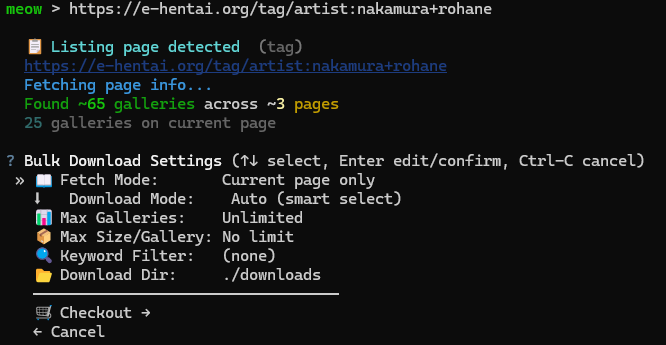

[English](README.md) | [繁體中文](README_zh.md) | [简体中文](README_zh_cn.md)

# CLI-Eh-Downloader

为 E-Hentai 与 ExHentai 设计的命令行画廊下载工具，内置交互式 Shell 界面。


*交互式 Shell 界面*


*命令列表与执行画面*


*交互式批量下载设置*

## 功能特色

- **交互式 Shell：** 直观、支持丰富文字色彩的命令行界面。
- **智能下载：** 支持标准画廊下载与自动 Torrent 种子下载（支持内置下载，或自动调用系统上的外部客户端如 qBittorrent 等）。
- **批量下载：** 粘贴标签、上传者或搜索结果等列表网址即可进行批量下载。包含交互式筛选结果页面、可自定义抓取范围以及进阶关键字过滤（支持 `||`、`&&`、`!`）。
- **实时状态：** 实时更新下载任务进度。
- **高度可配置：** 支持自定义下载目录、并发任务数量及 Cookies 登录凭证。
- **自动环境部署：** Windows 用户可通过内置的 `.bat` 脚本实现一键安装与启动。

## 安装与配置

### 系统要求

- **Python 3.11** 或更新版本。
- （可选）`libtorrent` 以支持内置的种子下载功能。若未安装，程序会将 `.torrent` 文件下载下来，并尝试使用系统默认的种子客户端（例如 qBittorrent 等）来进行下载。

### 下载项目 (Clone Repository)

首先，将项目 clone 到你的电脑上：
```bash
git clone https://github.com/RyuuMeow/CLI-Eh-Downloader.git
cd CLI-Eh-Downloader
```

### 快速开始 (Windows)

1. 双击运行 **`CLI-Eh-Downloader.bat`**。
2. 如果是首次运行，脚本会主动询问是否要自动创建虚拟环境 (`venv`) 并安装所有必要的依赖包。输入 `Y` 确认。
3. 安装完成后，将会自动进入交互式 Shell 界面。

### 手动安装 (所有平台)

1. 创建虚拟环境并激活它：
   ```bash
   python -m venv venv
   source venv/bin/activate  # Windows 环境请输入: venv\Scripts\activate
   ```
2. 安装依赖包：
   ```bash
   pip install -e .
   ```
3. 启动应用程序：
   ```bash
   ehdl
   # 或者直接通过 Python 模块启动: python -m cli_eh_downloader
   ```

## 使用方法

你可以进入交互式 Shell 界面，也可以在终端直接带参数执行：

```bash
# 启动交互式 Shell
ehdl

# 直接下载指定的画廊
ehdl <gallery_url>

# 强制通过 Torrent 下载
ehdl <gallery_url> --torrent
```

在交互式 Shell 中，可以输入 `help` 来查看所有支持的命令。

## 配置文件

程序会自动在 `~/.config/cli-eh-downloader/config.toml` （如果当前目录有 `config.toml` 则优先读取）创建配置文件。你可以在里面设置下载目录、下载限制以及用于身份验证的 Cookies。

## 免责声明

**仅供学术与教育研究用途。** 
本工具的开发目的仅为学习 Python 编程、API 交互及命令行界面设计。作者不认可亦不鼓励任何未经授权的版权内容下载与分发行为。使用本软件时，您必须对自己的行为负完全责任，并确保您的使用方式符合当地法律及相关网站的服务条款 (Terms of Service)。
